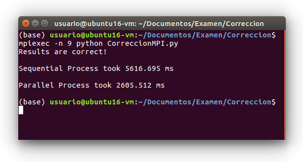
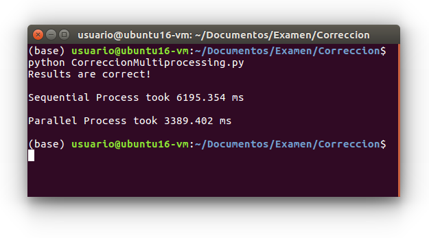

# MPI

El algoritmo se mejora utilizando listas en lugar de numpy arrays. Se consigue disminuir el tiempo de ejecución a un 46% del tiempo secuencial

# Multiprocessing

Los tiempos de ejecución se mejoran utilizando pools en lugar de manager.list y se consigue disminuir el tiempo de ejecución a un 54% del tiempo secuencial
